# Task 1. Prerequisites to build GraphSlam with known DA
## A
In this task the factor graph is initialized with the initial pose and other parameters. \
Using ```graph.print(True)``` the information in the graph is printed:

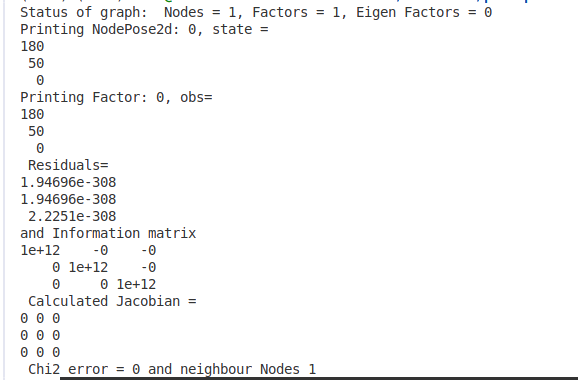

The initial plot is:
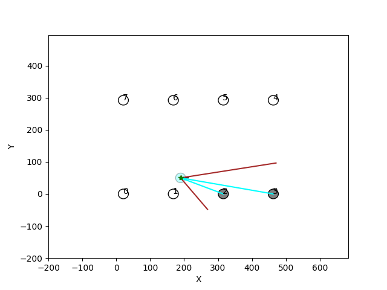

## B
In this task it is required to update ```GraphSlam.predict()```. The new 2d pose node is added with automatic initialization. The new factor is added based on motion, current node id, target node id and information matrix correpsonding to motion. \
After adding the odometry factor, the new pose is correctly initialized - [[190, 50, 0]]:
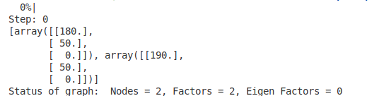

## C
In this task it is required to update ```GraphSlam.update()```. The observations are processed in the way that new ones are initialized with nodes and for all of them factors are added based on observations, current node id, landmark node id, information matrix corresponding to observation. \
After adding observation factors, landmark states are added to the graph:
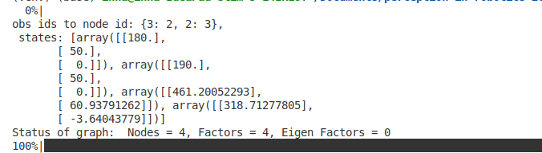

## D
In this task it is required to solve the optimization problem to find updates for robot and landmark poses using ```solve(mrob.GN)``` from ```mrob``` library. \
The ```run.py``` was launched with the argument ```num_steps=3```, so it is possible to see the process of updating. On the first step there are 4 nodes (current robot position, predicted robot position, 2 observations) and 4 factors. On the second step we don't see big changes in old nodes but one new node is added corresponding to the predicted robot position. On the third step we see updated nodes and extended amount of nodes and factors. So the graph is being extending and updating. 
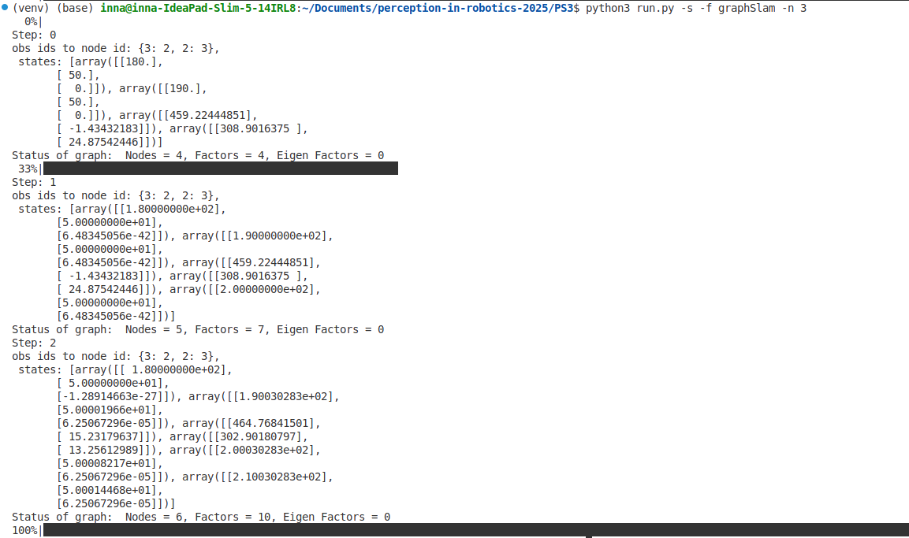

## E
In this task it is required to compare the information matrix taken from ```mrob.FGraph()``` and computed using adjacency matrix and a block diagonal matrix of information. The error between matrices is computed using the l2-norm and is of several thousand units.
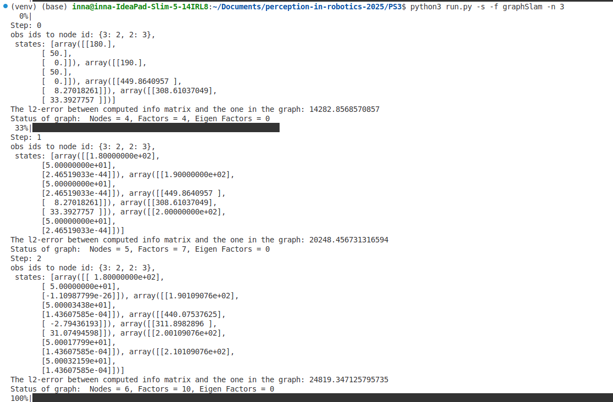

## F
In this task it is required to solve manually the normal equation and compare the solution of residuals with the one obtained using ```mrob``` library. The error is less than 1 unit, quite a small, so the solution is correct.
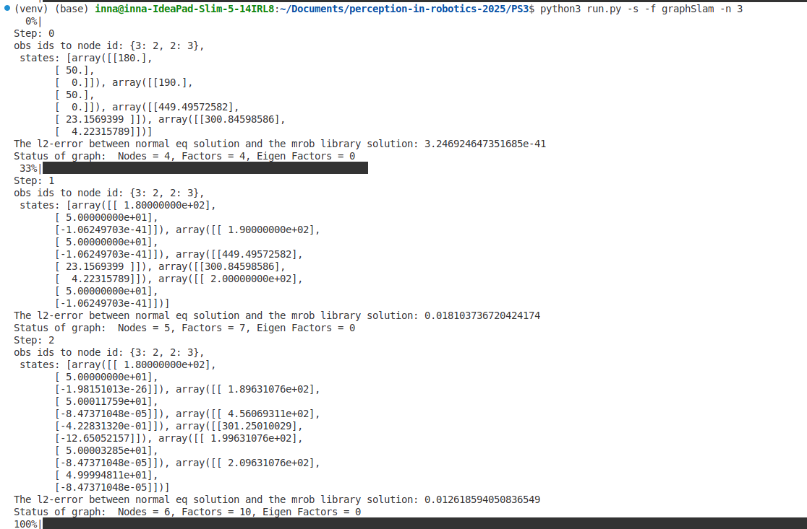

# Task 2: GraphSlam evaluation
## A
In this task it is required to calculate $\chi^2$ error on each time step. Overall, the curve is increasing within time, reaching sharp peaks approximately at turning points of robot trajectory. 
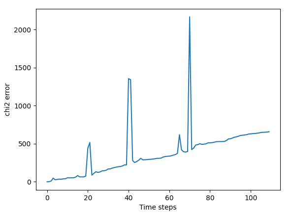

## B
The filtered trajectory obtained from GraphSlam algorithm. In addition, there is a recorded video in the file "graphSlam.mp4".
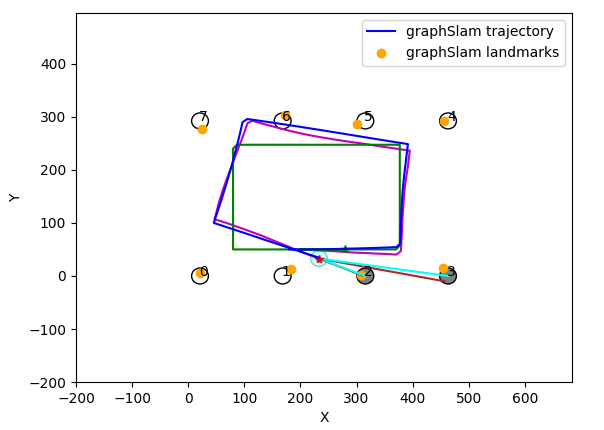

## C
The adjacency and information matrix after the 1st step of iteration. Matrices are 10 by 10: 2 robot poses with 3 coordinates and 2 landmarks with 2 coordinates. We can see the connection between robot coordinates and landmarks.

The adjacency and information matrix after the 1st step of iteration (using generated data):
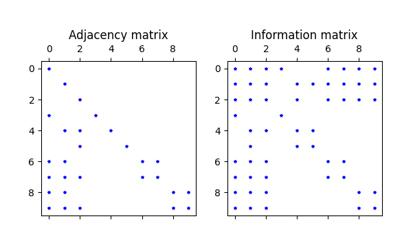

The adjacency and information matrix after the 100d step of iteration (using slam-evaluation-input.npy):
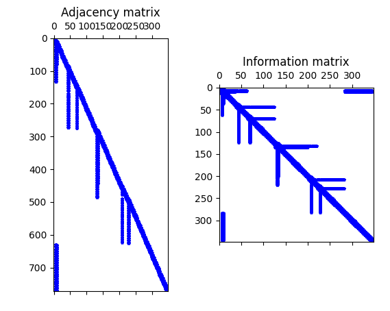

There is a common structure along both matrices. In the **adjacency matrix** the right upper part is empty because new robot states are dependent from the previous states, and a couple of robot states are linked with the same pair of landmarks (this causes "hanging tails"). The left bottom part means returning to the starting point. The **information matrix** is symmetric and shows correlations between robot positions and landmarks.

## D
In this task it is required to plot 3-sigma iso-contour for the last robot pose. For that, I extracted last pose state using ```graph.get_estimated_state()``` and information matrix from the graph. Using last pose state values, I found the indexes of information matrix corresponding to this pose. By inverting it, I got the covariance. The iso-contour is plotted using function ```plot2dcov()```.
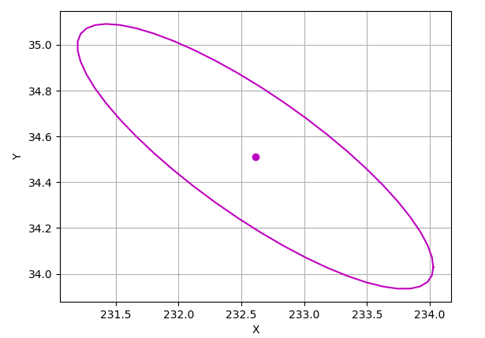

## E
In this task it is required to optimize the graph in the last time step until convergence. For that, I used both Gauss-Newton (GN) and Levenberg-Marquard (LM) algorithms. 

Solving using LM takes 3 iterations and the resulting $\chi^2$ error is 893.76.  
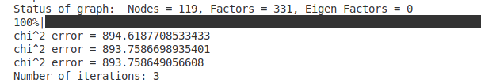

Solving using GN takes 6 iterations and the resulting $\chi^2$ error is 898.65.  
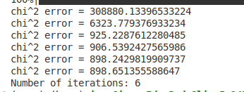